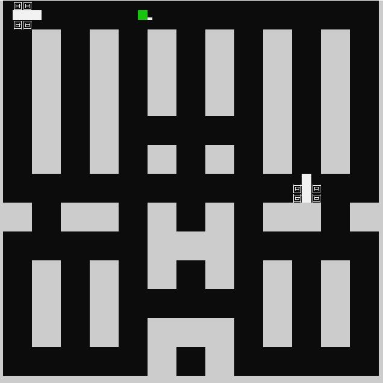

# TankGame

This is a simple game built in C++ and rlutil.
[Rlutil](https://github.com/tapio/rlutil) is simple utility collection to aid the creation of cross-platform console-mode roguelike games with C++.

## DEMO

The following is the output of tankwar game.

## REMARKS

This is an exercise project from C++ Design and Application Lesson in CYCU 2018 fall semester.

